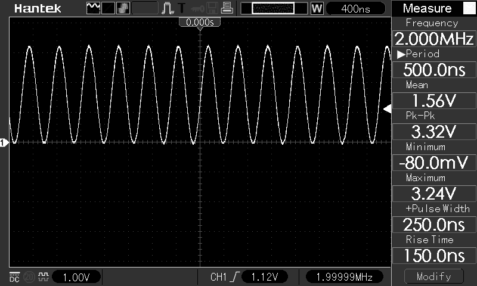
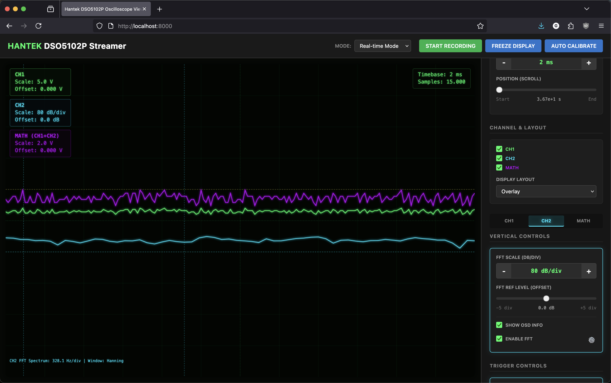
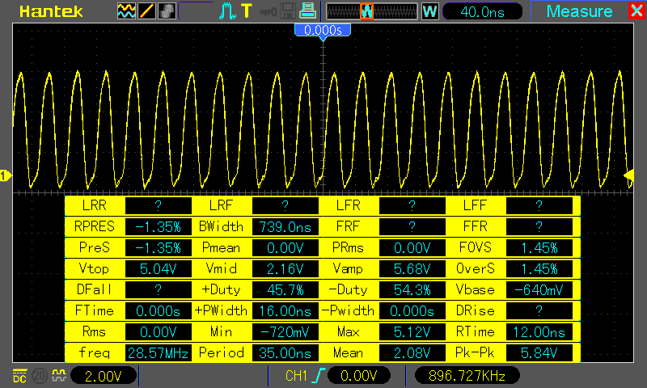
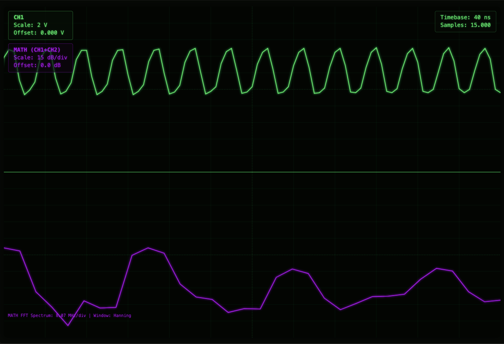

# DSO5102P-Python
 Access to the Hantek DSO5102P oscilloscope from Python 3.x

See these sites for details:
* https://web.archive.org/web/20241012215844/https://elinux.org/Das_Oszi_Protocol
* https://web.archive.org/web/20221013121459/https://randomprojects.org/wiki/Voltcraft_DSO-3062C



My Hantek DSO5102P reports VID:PID as 049f:505a so I added the file ``99-dso5102P.rules`` to ``/lib/udev/rules.d/``
(or to ``/etc/udev/rules.d/``)

```text
SUBSYSTEM=="usb", ENV{DEVTYPE}=="usb_device", ATTR{idVendor}=="049f", ATTR{idProduct}=="505a", MODE="0666"
```

and reload udev rules with

```bash
sudo udevadm control --reload-rules
sudo udevadm trigger
```

For MacOS, make sure libusb is available in `/opt/homebrew/lib/libusb-1.0.dylib`:

```bash
brew install libusb
```

Implemented and tested functions:
* Echo: send data bytes a returned unchanged
* ReadFile: read any file from the DSO filesystem
* LockControlPanel: lock/unlock DSO control panel
* StartAcquisition: start/stop acquisition in the DSO
* KeyTrigger: lets you simulate the press of nearly any button on the DSO's control panel.
* Screenshot: get a screenshot from the DSO (no color palette information)
* ReadSystemTime: read the DSO's system time
* RemoteShell: run shell commands in the DSO
* ReadSettings: read current DSO settings
* ReadSampleData: read the DSO's current probe data stream for the given channel

## Web oscilloscope

Uses FastAPI and websockets to stream chunks of ReadSampleData to a nice web GUI with some processing (Triggers, FFT,
(split) display and playback controls, and a MATH virtual channel). No fancy webgl shaders/rasterization rendering; Just
a regular HTML canvas.

```bash
pip install -r requirements.txt # (or equivalent for your venv)
pip install -r examples/web_oscilloscope/requirements.txt # (or equivalent for your venv)
python examples/web_oscilloscope/app.py # (or equivalent for your venv)
open http://localhost:8000 # (or equivalent for your os)
```



Because it tries to read and process into CSV records and stream to the client at (up to) 1GSa/s per channel, this tool
is pretty resource intensive before even displaying or storing anything. Then the client has to parse that stuff and
display and store it. Several optimizations are applied through this whole pipeline, but don't count on it working too
well on a thin client over a choppy WiFi. Best used on a capable laptop running both the server and localhost client.
Or just capture first, then replay it offline in playback mode in a capable machine.

The device's USB 2 interface maxes out aat 480Mbit/s, so sustained 1GSa/s streaming is not possible anyway. Relatively
big gaps and jitter inducing non-RT syscall delays between batches also limit the usability envelope of this tool. To
mitigate this the tool operates over each sample batch individually as a separate capture when necessary. In any case
the measurement of signals in the tens of MHz already degrades pretty heavily due to the relatively high capacitance of
the bundled passive probes at those frequencies: Label claims up to 100MHz; I wouldn't go beyond 10 for reasonable
accuracy, as evidenced by the 2 screenshots below capturing an Amiga 500 30Mhz oscillator signal (Yeah, that is supposed
to be square).




